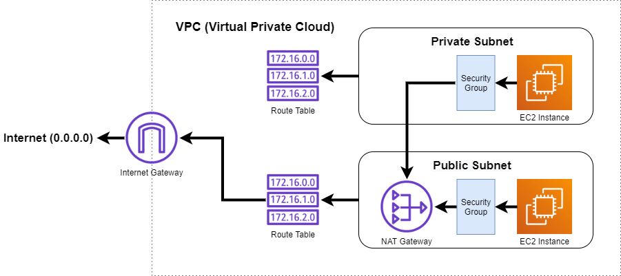

# Secure VPC Environment on AWS using Terraform

This Terraform project provisions a secure and scalable networking setup in AWS. It follows best practices for cloud network segmentation by creating both public and private subnets, enabling controlled internet access for different resources.

## What it Creates

- **One VPC**  
  A custom Virtual Private Cloud with defined CIDR block.

- **Public and Private Subnets**  
  Resources needing internet access (like bastion hosts) are placed in the public subnet, while application/database servers stay in the private subnet.

- **Internet Gateway (IGW)**  
  Allows outbound internet access for resources in the public subnet.

- **NAT Gateway**  
  Enables outbound internet access for private subnet resources without exposing them to incoming traffic from the internet.

- **Route Tables**  
  - Public subnet uses a route table connected to the Internet Gateway.
  - Private subnet uses a route table that routes traffic through the NAT Gateway.

## Use Cases

- Launch EC2 instances in a secure network with controlled internet access.
- Deploy public-facing services (e.g., web servers) in public subnet.
- Deploy backend or sensitive services (e.g., databases, APIs) in private subnet.

## Architechture

